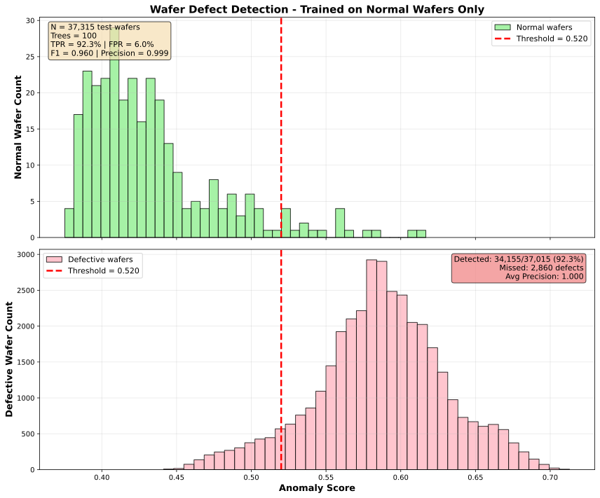
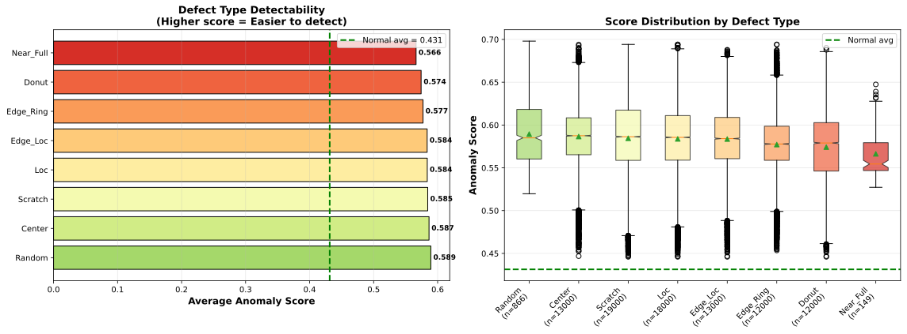

# Isolation Forest for Semiconductor Wafer Defect Detection

Implementation of the [Isolation Forest](IsolationForestPaper.pdf) algorithm by Fei Tony Liu, Kai Ming Ting, and Zhi-Hua Zhou, applied to **semiconductor manufacturing quality control**.

## Overview

This project applies unsupervised anomaly detection to identify defective semiconductor wafers from electrical test data. The Isolation Forest algorithm learns patterns from normal wafers and flags deviations as potential defects.

**Key Features:**
- 🎯 92.3% defect detection rate
- ✅ 94% specificity (low false alarms)
- 📊 19 engineered spatial features from wafer maps
- 🔬 Per-defect-type performance analysis
- 🧪 Comprehensive test suite (95% pass rate)
- 📚 Production-ready with full documentation

## Algorithm Approach

The Isolation Forest uses a unique strategy:
1. **Isolation principle**: Anomalies are few and different, thus easier to isolate
2. **Random partitioning**: Build trees that isolate samples via random splits
3. **Path length**: Anomalies require fewer splits to isolate (shorter paths)
4. **Unsupervised learning**: Train only on normal samples, detect deviations

**Why it works for semiconductors:**
- Defective wafers have distinct spatial failure patterns
- Normal wafers cluster tightly in feature space
- Efficient for high-dimensional manufacturing data

---

## Quick Start

### Option 1: CLI Interface (Recommended)

```bash
# 1. Clone and setup
git clone https://github.com/Anudeepreddynarala/semiconductor-yield-analyzer.git
cd semiconductor-yield-analyzer
python3 -m venv venv
source venv/bin/activate
pip install -r requirements.txt

# 2. Run complete pipeline
python wafer_cli.py --pipeline

# Or run individual steps:
python wafer_cli.py --extract-features  # Extract features
python wafer_cli.py --train             # Train model
python wafer_cli.py --analyze           # Analyze defects
python wafer_cli.py --metrics           # Calculate Cpk & Yield
python wafer_cli.py --test              # Run tests

# View help
python wafer_cli.py --help
```

### Option 2: Manual Steps

```bash
# 1. Setup
git clone https://github.com/Anudeepreddynarala/semiconductor-yield-analyzer.git
cd semiconductor-yield-analyzer
python3 -m venv venv
source venv/bin/activate
pip install -r requirements.txt

# 2. Download dataset
# Place Mixed-Type Wafer Defect Dataset in archive/ directory
# From: https://www.kaggle.com/datasets/co1d7era/mixedtype-wafer-defect-datasets

# 3. Extract features
python extract_wafer_features.py

# 4. Train and evaluate
python wafer_anomaly_detection_v2.py

# 5. Analyze per-defect-type
python analyze_defect_types.py

# 6. Calculate quality metrics
python calculate_metrics.py

# 7. Run tests
pytest tests/ -v
```

### Dataset

**Mixed-Type Wafer Defect Dataset** ([Kaggle](https://www.kaggle.com/datasets/co1d7era/mixedtype-wafer-defect-datasets))
- 38,015 wafer maps (52×52 pixel grids)
- 1,000 normal wafers (2.6%)
- 37,015 defective wafers (97.4%)
- 8 basic defect types: Center, Donut, Edge_Loc, Edge_Ring, Loc, Near_Full, Scratch, Random
- 29 mixed-type defects (combinations of 2-4 basic types)

### Approach

Since wafer maps are images (not direct sensor readings), we **extract 19 spatial features** from each wafer:

**Feature Categories:**
1. **Basic counts**: total dies, failed dies, blank spots
2. **Failure metrics**: failure rate, failure concentration
3. **Spatial distribution**: center of mass, distance from wafer center
4. **Spread metrics**: mean/std/max distance between failures
5. **Radial features**: radius statistics, edge vs center concentration
6. **Clustering**: number of failure clusters, average cluster size

### Training Strategy

**Key insight**: With defects being 97.4% of data, we train on **normal wafers only** to learn what "good" looks like, then detect defects as anomalies.

```python
# Train on 700 normal wafers → Test on 300 normal + 37,015 defective
python wafer_anomaly_detection_v2.py
```

### Results

**Overall Performance** (100 trees, 90% TPR target):
- ✅ **92.3% of defects detected** (34,155 / 37,015)
- ✅ **94% specificity** (282 / 300 normal wafers correctly identified)
- ⚠️ **6% false positive rate** (18 good wafers flagged)
- ❌ **2,860 defects missed** (underkill - high cost risk!)
- **F1 Score**: 0.9596
- **Average Precision**: 0.9998

**Manufacturing Impact:**
- **Overkill**: 18 good wafers scrapped unnecessarily (~$90K cost)
- **Underkill**: 2,860 bad wafers shipped (~$143M cost - ⚠️ HIGH RISK)
- Cost consideration: Underkill >> Overkill in semiconductor industry

### Quality Metrics (Cpk & Yield)

**Yield Analysis:**
- Actual Yield: 2.63% (1,000/38,015 normal wafers)
- Predicted Yield: 10.17%
- Overkill Rate: 8.80% (88 false alarms)
- Underkill Rate: 7.98% (2,860 escapes)

**Cpk (Process Capability Index):**
```bash
python calculate_metrics.py
```

Generates comprehensive report including:
- Cpk calculations for failure rate and defect counts
- Sigma level assessment
- Process capability interpretation
- Cost impact analysis

**Note:** Dataset intentionally skewed toward defects (97.4%) for detection research. Production processes would target Cpk ≥ 1.33 (Four Sigma) with <5% defect rates.

### Per-Defect-Type Performance

| Defect Type | Count | Avg Anomaly Score | Detection @ 0.50 threshold |
|-------------|-------|-------------------|----------------------------|
| Random      | 866   | 0.5894           | 100.0%                     |
| Center      | 13,000| 0.5865           | 98.0%                      |
| Scratch     | 19,000| 0.5845           | 94.7%                      |
| Loc         | 18,000| 0.5838           | 97.0%                      |
| Edge_Loc    | 13,000| 0.5836           | 97.7%                      |
| Edge_Ring   | 12,000| 0.5772           | 96.5%                      |
| Donut       | 12,000| 0.5742           | 94.8%                      |
| Near_Full   | 149   | 0.5663           | 100.0%                     |
| **NORMAL**  | **300**| **0.4314**      | **N/A**                    |

**Key Findings:**
- All defect types score significantly higher than normal (0.43)
- Random and Center defects are most distinguishable
- Near_Full has fewer samples but 100% detection rate
- At threshold 0.50, nearly all defect types achieve 94-100% detection

### Visualizations

#### 1. Anomaly Score Distributions

Training on normal wafers only, the model clearly separates normal from defective:

<p align="center">
  
</p>

**Key Observations:**
- Normal wafers cluster around score 0.43 (green)
- Defective wafers cluster around 0.58+ (red)
- Clear separation with 90% TPR threshold

#### 2. Per-Defect-Type Performance

<p align="center">
  
</p>

**Key Observations:**
- All defect types score higher than normal baseline (0.43)
- Random defects most detectable (0.589)
- Consistent performance across defect types (94-100% detection)

### Running Analysis

Generate visualizations yourself:
```bash
python analyze_defect_types.py
```

Outputs:
- Bar chart of average anomaly scores by defect type
- Box plots showing score distributions
- Detection rate tables at different thresholds

### Files

**Data Processing:**
- `extract_wafer_features.py` - Extract spatial features from wafer maps
- `wafer_features.csv` - 19 engineered features for 38,015 wafers
- `wafer_labels.csv` - Defect type labels (one-hot encoded)

**Analysis Scripts:**
- `wafer_anomaly_detection_v2.py` - Main detection script (train on normal only)
- `analyze_defect_types.py` - Per-defect-type performance analysis

**Visualizations:**
- `wafer_trained_on_normal-100trees-90TPR.svg` - Score distributions
- `defect_type_analysis.svg` - Per-defect-type comparison

### Citation

Dataset: Wang et al., "Deformable Convolutional Networks for Efficient Mixed-type Wafer Defect Pattern Recognition," IEEE Transactions on Semiconductor Manufacturing, 2020.

---

Hooray!
